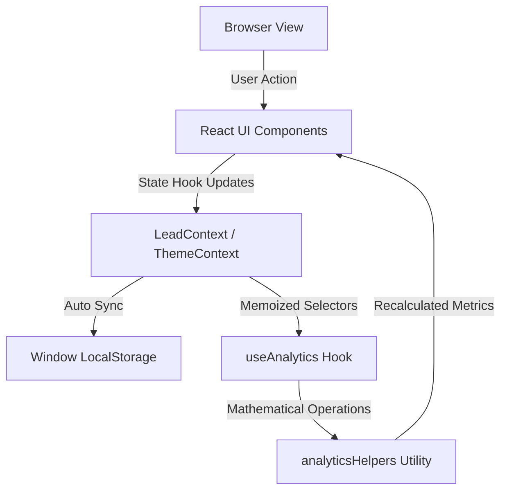
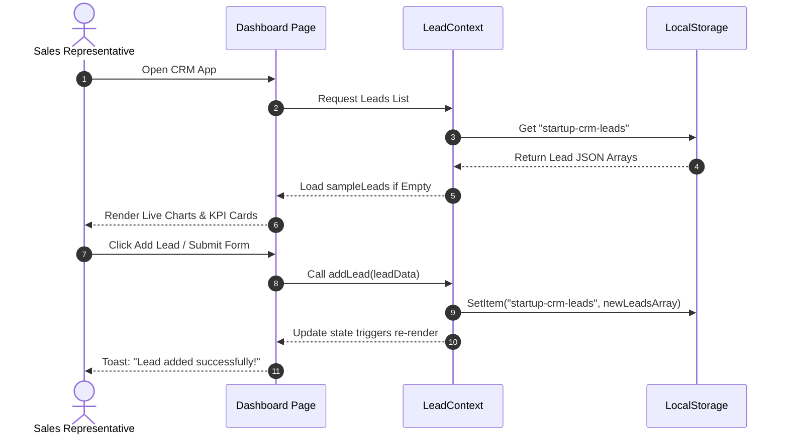

# Startup CRM Lite

<div align="center">
  
  <p><strong>An Elegant, High-Fidelity Client-Side CRM for Startup Lead Management</strong></p>

  [](https://react.dev)
  [](https://vite.dev)
  [](https://tailwindcss.com)
  [](https://oxc.rs)
  [](https://opensource.org/licenses/MIT)
  []()
</div>

---

## 📋 Table of Contents

- [1. Project Overview](#1-project-overview)
- [2. Problem Statement](#2-problem-statement)
- [3. Vision & Objectives](#3-vision--objectives)
- [4. Key Features](#4-key-features)
- [5. Target Users & Use Cases](#5-target-users--use-cases)
- [6. Business Value](#6-business-value)
- [7. Complete System Architecture](#7-complete-system-architecture)
  - [High-Level Architecture Overview](#high-level-architecture-overview)
  - [Application Workflow](#application-workflow)
  - [End-to-End User Flow](#end-to-end-user-flow)
- [8. Technology Stack](#8-technology-stack)
- [9. Project Folder Structure](#9-project-folder-structure)
- [10. Frontend Architecture](#10-frontend-architecture)
  - [Component Architecture (Atomic Design)](#component-architecture-atomic-design)
  - [Styling Strategy (Tailwind + Design Tokens)](#styling-strategy-tailwind--design-tokens)
  - [State Management](#state-management)
  - [Storage Strategy](#storage-strategy)
- [11. Backend & Database Architecture (Local & Sandbox Mocking)](#11-backend--database-architecture-local--sandbox-mocking)
- [12. Development Prerequisites & Setup](#12-development-prerequisites--setup)
- [13. Installation & Run Guide](#13-installation--run-guide)
- [14. Testing Strategy](#14-testing-strategy)
- [15. Security & Performance Optimizations](#15-security--performance-optimizations)
- [16. Coding Standards & Conventions](#16-coding-standards--conventions)
- [17. Versioning & Branching Strategy](#17-versioning--branching-strategy)
- [18. Contribution Guidelines & Release Process](#18-contribution-guidelines--release-process)
- [19. Known Limitations & Future Roadmap](#19-known-limitations--future-roadmap)
- [20. FAQ & Troubleshooting Guide](#20-faq--troubleshooting-guide)
- [21. Changelog](#21-changelog)
- [22. License & Contact Information](#22-license--contact-information)

---

## 1. Project Overview

**Startup CRM Lite** is a premium, client-side Lead Management CRM specifically optimized for early-stage startup teams. Inspired by the designs of Stripe, Linear, and Notion, it delivers a fluid SaaS dashboard, real-time sales pipeline visualizations, interactive charts, and complete lead Lifecycle CRUD tracking. It requires zero cloud databases or API setups, functioning instantly out of the box with browser-native data persistence.

---

## 2. Problem Statement

Standard CRM systems (e.g., Salesforce, HubSpot) present multiple barriers for early-stage teams:
- **High Friction & Bloat**: Complex fields, steep learning curves, and slow load times.
- **Overhead Costs**: Expensive seat licensing models before a product achieves product-market fit.
- **No-Database Setup Barriers**: Setting up databases, hosting servers, or configuring schemas just to organize early leads delays execution.
- **Visual Clutter**: Clunky UI designs that distract sales reps from focusing on their lead funnel.

Startup CRM Lite bypasses these blockers by establishing a local, secure sandbox environment for lead tracking that runs entirely in the browser, offering premium design aesthetics with minimal operational overhead.

---

## 3. Vision & Objectives

- **Elite Aesthetics**: Offer Stripe/Linear style visual experiences using curated design tokens, clean typography, smooth transitions, and high-fidelity layouts.
- **Zero-Config Deployment**: Allow developers to download, install, and run the CRM locally or host it on a static CDN in seconds.
- **Instant CRUD Execution**: Facilitate lead creation, status updates, deals valuation, ownership tracking, and data exports.
- **Interactive Conversions Intelligence**: Provide sales reps with instant sales velocity tracking, win rates, contribution-style activity feeds, and forecasts.

---

## 4. Key Features

- **Live KPI Panel**: Dynamic reporting on Total Leads, Opportunity Win Rate, Pipeline Value, and Active Deals with visual trend indicators.
- **Lead Lifecycle Management**: Interactive dashboard tables and cards that support inline searching, multi-criteria filtering, updating stages (New, Contacted, Meeting Scheduled, Proposal Sent, Won, Lost), and deleting records.
- **Analytics Visuals**: Comprehensive charts built on Recharts illustrating monthly conversion rates, revenue trends, lead source breakdowns, and conversion funnels.
- **Top Performers Leaderboard**: Custom sales rep rankings based on closed-won deal valuations.
- **Activity Heatmap**: A GitHub-style contribution calendar mapping user action frequency over a rolling 30-day timeline.
- **Premium Dual-Theme Support**: Instant light and dark modes utilizing HSL tailored colors and glassmorphism.
- **Responsive Layout**: Designed mobile-first, compressing sidebars into modal drawers on tablet and mobile viewports.

---

## 5. Target Users & Use Cases

### Target Users
- **Startup Founders**: Rapidly qualified early sign-ups and tracking investor interactions.
- **Sales Managers**: Evaluating weekly conversion funnels, revenue projections, and sales rep deal weights.
- **Growth Engineers**: Linking early beta registrations to a lightweight tracking panel.

### Primary Use Cases
1. **Qualifying Leads**: Log emails, companies, phones, sources, and estimated deal value.
2. **funnel progression**: Move contacts from "New" to "Meeting Scheduled", then "Won" or "Lost".
3. **Data Portability**: Export current lead databases as structured CSV spreadsheets instantly.
4. **Performance Monitoring**: Check who closed the most revenue and calculate lead acquisition velocities.

---

## 6. Business Value

- **Accelerated Time-to-Organize**: Zero infrastructure config allows sales cycles to start immediately.
- **Cost Reduction**: Save hundreds of dollars monthly in CRM platform subscriptions during the pre-revenue phase.
- **Visual Alignment**: A simplified UI ensures sales reps input cleaner, more consistent customer information.

---

## 7. Complete System Architecture

### High-Level Architecture Overview

Startup CRM Lite is structured as a client-side React Single Page Application (SPA). It maintains a unidirectional data flow supported by React Contexts and hooks:



### Application Workflow

1. **User Input Trigger**: User fills a lead form or logs a meeting.
2. **Context Dispatch**: The action routes through `LeadProvider`.
3. **Storage Persistence**: State updates are written as serialized JSON keys (`startup-crm-leads`) to the browser's `localStorage`.
4. **Reactive Update**: Custom hook `useAnalytics` intercepts the change, triggering `analyticsHelpers` to recount metrics.
5. **View Update**: React components re-render with the latest calculations. Toast notifications display status messages using design-system-aligned colors.

### End-to-End User Flow



---

## 8. Technology Stack

### Core Technologies
- **React 19.2**: Utilizes React 19's performance, concurrent rendering, and clean JSX structures.
- **React Router Dom 7.18**: Manages page paths, lazy loading routes, and wildcard routing.
- **Recharts 3.9**: Handles client-side SVG charting, pipelines, funnels, and area graphs.
- **Lucide React 1.21**: Comprehensive modern vector icons.
- **React Hot Toast 2.6**: Micro-interactive toast alerts styled with CSS variables.

### Build & Compilation
- **Vite 8.1**: Ultra-fast hot module reloading (HMR) and optimized Rollup builds.
- **Tailwind CSS v4.0**: Brand-new Tailwind v4 engine using `@tailwindcss/vite` integration for lightning-fast compilation, native CSS `@import "tailwindcss"` processing, and utility classes.

### Code Verification
- **Oxlint 1.69**: Next-generation Rust-based linter that runs rules in milliseconds to keep code clean and standardized.

---

## 9. Project Folder Structure

```
startup-crm-lite/
├── .vscode/                     # VSCode workspace configurations
├── dist/                        # Production build outputs (compiled static bundle)
├── public/                      # Static assets (images, manifest files, favicons)
├── src/                         # Application source root
│   ├── assets/                  # Local media assets (logos, svg vectors)
│   ├── components/              # UI Component Library (Atomic Design)
│   │   ├── atoms/               # Smallest UI units (Buttons, Badges, Labels)
│   │   ├── common/              # Shared layout units (ThemeToggle, FilterBar, SearchBar)
│   │   ├── dashboard/           # Dashboard-specific panel cards and activity feeds
│   │   ├── leads/               # Lead-specific modals, tables, forms, and cards
│   │   ├── analytics/           # Charts, skeleton loaders, and helper metrics cards
│   │   ├── organisms/           # High-level components (Headers, Sidebars, Modals)
│   │   ├── templates/           # Shared page shell grid layouts (PageLayout)
│   │   └── DesignSystemGuide.jsx# Interactive visualization component showing all design tokens
│   ├── constants/               # Global configuration constants (Chart color schemes)
│   ├── context/                 # React Context State Providers (Lead and Theme context)
│   ├── data/                    # Initial static datasets (Sample CRM lead entries)
│   ├── design/                  # JavaScript Design Tokens
│   ├── hooks/                   # Custom business logic hooks (useAnalytics, useLocalStorage)
│   ├── pages/                   # Major page assemblies (Dashboard, Leads, Analytics, NotFound)
│   ├── routes/                  # React routing registry and lazy resolution fallbacks
│   ├── styles/                  # Global vanilla design system definitions and variables
│   ├── utils/                   # Pure business logic mathematical utilities (analytics calculation)
│   ├── App.css                  # Small app-level overrides
│   ├── App.jsx                  # Root container mounting router & toast context
│   ├── index.css                # Base CSS importing Tailwind CSS v4 directives
│   └── main.jsx                 # Main bootstrapper mounting StrictMode and Context Providers
├── .gitignore                   # Version control exclusions file
├── .oxlintrc.json               # Oxlint linter rules config
├── package.json                 # Project dependencies, scripts, and package version metadata
├── vite.config.js               # Vite build configuration running Tailwind CSS v4 compiler plugins
└── DESIGN_SYSTEM.md             # Complete design specifications & guidelines
```

---

## 10. Frontend Architecture

### Component Architecture (Atomic Design)

Startup CRM Lite components are organized hierarchically:
- **Atoms**: Pure inputs, action buttons ([Button.jsx](file:///c:/Users/dell/Desktop/internproject/startup-crm-lite/src/components/atoms/Button.jsx)), and tag indicators ([Badge.jsx](file:///c:/Users/dell/Desktop/internproject/startup-crm-lite/src/components/atoms/Badge.jsx)) that do not fetch data.
- **Molecules/Common**: Combined items like input groups, filters ([FilterBar.jsx](file:///c:/Users/dell/Desktop/internproject/startup-crm-lite/src/components/common/FilterBar.jsx)), search elements ([SearchBar.jsx](file:///c:/Users/dell/Desktop/internproject/startup-crm-lite/src/components/common/SearchBar.jsx)), or theme toggles.
- **Organisms**: Complex dashboard widgets, sidebar menus ([Sidebar.jsx](file:///c:/Users/dell/Desktop/internproject/startup-crm-lite/src/components/organisms/Sidebar.jsx)), and form dialogs ([LeadForm.jsx](file:///c:/Users/dell/Desktop/internproject/startup-crm-lite/src/components/leads/LeadForm.jsx)).
- **Templates**: Structural page wireframes ([Layout.jsx](file:///c:/Users/dell/Desktop/internproject/startup-crm-lite/src/components/templates/Layout.jsx)) managing padding grids and sidebar constraints.
- **Pages**: Top-level assemblies ([Dashboard.jsx](file:///c:/Users/dell/Desktop/internproject/startup-crm-lite/src/pages/Dashboard.jsx), [Leads.jsx](file:///c:/Users/dell/Desktop/internproject/startup-crm-lite/src/pages/Leads.jsx), [Analytics.jsx](file:///c:/Users/dell/Desktop/internproject/startup-crm-lite/src/pages/Analytics.jsx)).

### Styling Strategy (Tailwind + Design Tokens)

The project leverages a dual styling mechanism:
1. **Design Tokens**: Standardized colors, spacing levels, shadows, border-radii, and animations. Defined in JS ([tokens.js](file:///c:/Users/dell/Desktop/internproject/startup-crm-lite/src/design/tokens.js)) and in CSS variables ([design-system.css](file:///c:/Users/dell/Desktop/internproject/startup-crm-lite/src/styles/design-system.css)).
2. **Tailwind Utility Classes**: Utility classes are combined with CSS variables (`var(--color-surface)`, `var(--space-6)`) to build layout properties.
3. **Interactive States**: Clean hover elevations, active scale translations (98%), and keyboard outline rings.

### State Management

Global state is organized inside two main React Contexts:
- **`LeadContext`**: Controls the leads data array. Exposes `leads` state, `addLead`, `updateLead`, `deleteLead`, and `getLeadById`.
- **`ThemeContext`**: Controls the light/dark preferences. Toggles the `.dark` class on the root `<html>` element and updates local preferences.

### Storage Strategy

The custom state synchronization hook `useLocalStorage` abstracts browser persistence:
- **Resilience**: Features full try/catch blocks that gracefully handle `QuotaExceededError` or private-browsing modes where local storage is disabled by returning functional fallback defaults.
- **Parsing Fallbacks**: Standardizes JSON structure parsing with automatic logging for corrupt storage strings.

---

## 11. Backend & Database Architecture (Local & Sandbox Mocking)

> [!IMPORTANT]
> Startup CRM Lite operates entirely on the client side. There is no active remote database or API server setup required.

- **Data Persistence**: A mock database repository is established in the browser's persistent key-value store.
- **Data Schemas**: Standard CRM Lead object structure is documented in JSDoc in the context directory:
  | Field | Type | Description |
  |---|---|---|
  | `id` | string | Unique primary key (UUIDv4) |
  | `name` | string | Full name of the lead contact |
  | `company` | string | Organization name |
  | `email` | string | Primary email contact address |
  | `phone` | string | Standardized contact telephone number |
  | `status` | string | Stage: `New`, `Contacted`, `Meeting Scheduled`, `Proposal Sent`, `Won`, `Lost` |
  | `source` | string | Source: `Website`, `Referral`, `LinkedIn`, `Cold Call`, `Email Campaign`, `Other` |
  | `value` | number | Estimated monetary valuation in USD |
  | `owner` | string | Assigned Sales Rep (e.g., `Sarah`, `Alex`, `David`) |
  | `createdAt` | string | ISO Timestamp representation of lead initialization date |
  | `lastContact`| string | ISO Timestamp of last lead modification |

---

## 12. Development Prerequisites & Setup

Ensure the following tools are installed on your workstation before launching setup:
- **Node.js**: `v18.0.0` or higher (LTS recommended).
- **Package Manager**: `npm` (v9.0.0+), `yarn`, or `pnpm`.

---

## 13. Installation & Run Guide

Follow these steps to run the application locally:

### 1. Clone the repository and navigate to the project directory:
```bash
cd startup-crm-lite
```

### 2. Install dependencies:
```bash
npm install
```

### 3. Start the Vite local development server:
```bash
npm run dev
```
*The terminal will output the local network URL (typically `http://localhost:5173`).*

### 4. Build static production assets:
```bash
npm run build
```
*Compiled assets will be outputted to the `dist/` directory, optimized and ready to serve from any static host.*

### 5. Preview the production build locally:
```bash
npm run preview
```

### 6. Lint the source code:
```bash
npm run lint
```
*Executes Oxlint rules over all components and utilities.*

---

## 14. Testing Strategy

### Manual Testing Guidelines
1. **Adding Leads**: Click the "Add Lead" action on the Dashboard or Leads page, fill the form, and submit. Verify that the lead is added to the table, stats update, and a success toast appears.
2. **Status Changes**: Modify a lead's status to "Won". Ensure that the "Pipeline Value" decreases, the "Win Rate" increases, and the change is reflected in the Analytics funnel.
3. **Filtering and Search**: Enter a term in the search bar. Verify that results filter instantly. Select "Referral" in the source filters to check chart isolation.
4. **Theme Resilience**: Toggle dark mode. Refresh the browser and ensure the dark theme persists without flashing light states first.

### Recommended Automated Testing Setup
- **Unit Testing**: Configure `Vitest` and `React Testing Library` to test utility computations in `src/utils/analyticsHelpers.js` and custom hooks.
- **E2E Testing**: Integrate `Playwright` to simulate pipeline changes and export operations.

---

## 15. Security & Performance Optimizations

### Performance Optimizations
- **Memoized Calculations**: All major statistical metrics are calculated in `useAnalytics` using `useMemo`. This prevents expensive array traversal on every UI re-render.
- **Lazy Loaded Routes**: Major pages (`Dashboard`, `Leads`, `Analytics`, `NotFound`) are resolved lazily using React's `lazy` and `Suspense`. This reduces initial script payloads.
- **Sub-10ms Transitions**: Dynamic micro-animations are limited to CSS transitions using hardware-accelerated transforms (`translateY`, `scale`) for smooth 60fps rendering.

### Security Configurations
- **XSS Sanitation**: React JSX automatically escapes inputs to prevent cross-site scripting vulnerabilities during list rendering.
- **Data Validation**: The CRM form validates emails, requires numbers for deal values, and parses status types before updating state.
- **Safe JSON Fallbacks**: String parsing operations include catch fallbacks to prevent runtime application crashes if storage values are altered.

---

## 16. Coding Standards & Project Conventions

- **Component Structure**: Keep templates, pages, and atomic components separated. Avoid injecting side-effects inside pure presentation atoms.
- **File Naming Rules**:
  - React Component Files: PascalCase (e.g., `LeadTable.jsx`).
  - Styling Files: Standard CSS naming mapped to components (e.g., `Sidebar.css`).
  - Logic/Helpers/Hooks: camelCase (e.g., `useLocalStorage.js`, `analyticsHelpers.js`).
- **JSDoc Style Guide**: Document functions, contexts, and hook structures using complete JSDoc annotations to clarify parameter expectations.
- **Linter Adherence**: Run `npm run lint` regularly. Do not bypass rules unless explicitly required.

---

## 17. Versioning & Branching Strategy

The project follows standard Semantic Versioning (`MAJOR.MINOR.PATCH`) alongside a simplified Git Flow branching strategy:

- **`main`**: Reflects the production-ready code.
- **`develop`**: The integration branch for new features and visual iterations.
- **`feature/*`**: Short-lived branches created for specific component features (e.g., `feature/analytics-export`).
- **`release/*`**: Pre-production testing and tagging branches.

---

## 18. Contribution Guidelines & Release Process

We welcome contributions from the open-source community:

1. **Fork the Repository**: Clone your fork to your workstation.
2. **Create a Feature Branch**: Work off `develop` (`git checkout -b feature/cool-new-feature`).
3. **Commit Code**: Write clean commits conforming to Conventional Commits standards (e.g., `feat(analytics): add monthly export capabilities`).
4. **Lint and Format**: Run `npm run lint` and verify files build successfully.
5. **Open a Pull Request**: Target the `develop` branch of the upstream repository, detailing your changes.

---

## 19. Known Limitations & Future Roadmap

### Current Limitations
- **Single Browser Bound**: Because data is stored in `localStorage`, leads are not synchronized across multiple machines or browsers.
- **Local File Constraints**: CSV exports are triggered via client-side download buffers. Larger datasets may load slower on older hardware.

### Future Roadmap
- [ ] **Cloud Sync Service**: Optional authentication layer to sync data with an external database.
- [ ] **Extended Custom Fields**: Allow users to dynamically define custom columns (e.g., lead score, contract length).
- [ ] **Email Integration**: Connect leads directly to email communication triggers.

---

## 20. FAQ & Troubleshooting Guide

### Q: I refreshed my page, and all my leads disappeared. What happened?
**A**: Ensure that your browser is not running in a strict private-browsing or incognito mode that clears local storage on refresh, and check that storage is enabled. If storage remains empty, initial sample leads will reload by default.

### Q: How do I clear the mock database and start from scratch?
**A**: You can clear your storage key using your browser's Developer Tools (Application -> Local Storage -> Clear) or run `localStorage.removeItem('startup-crm-leads')` in the console.

### Q: Why do my charts show no data in the funnel section?
**A**: Funnel charts rely on status progression dates. Make sure you have leads associated with those stages.

---

## 21. Changelog

### v1.0.0
- Official release of Startup CRM Lite.
- Dynamic KPIs, Recharts Analytics graphs, and GitHub-style contribution heatmaps.
- Complete leads table with status CRUD capabilities and CSV exporting.
- Modern responsive layout and dual-theme support.

---

## 22. License & Contact Information

This project is licensed under the **MIT License**. You are free to modify, host, and distribute it.

For support, issues, or suggestions, please open a GitHub issue or contact the development lead:
- **Developer Name**: Technical Documentation Architect & Engineering Lead
- **Workspace Project Location**: [startup-crm-lite](file:///c:/Users/dell/Desktop/internproject/startup-crm-lite)
- **Project URL**: `https://github.com/your-username/startup-crm-lite` (Placeholder)
- **Email Support**: support@startup-crm-lite.io (Placeholder)

---

<div align="center">
  <p><strong>Startup CRM Lite - Helping startups streamline growth efficiently</strong></p>
</div>
